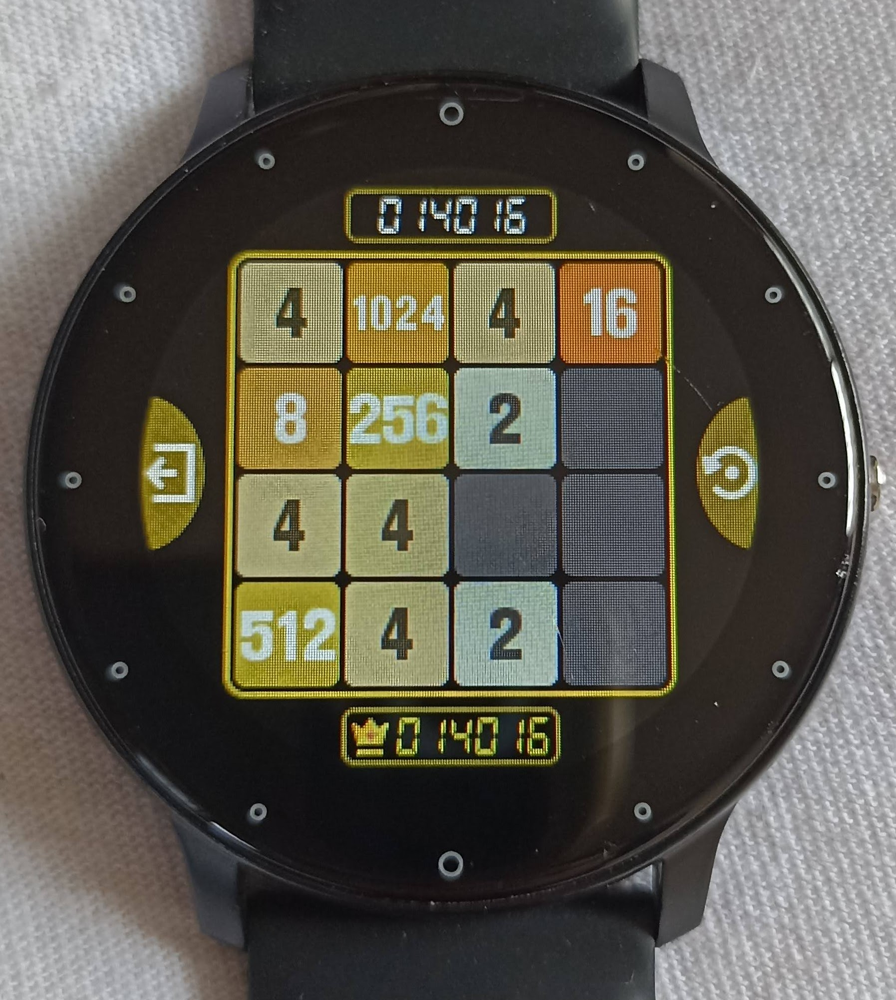

## Smartwatch 2048 AI Assistant

### How I Started This Project

I bought a waterproof sport smartwatch on MercadoLibre, which has two games: 1) YoungBird and 2) 2048. I didn't know about the 2048 game before until I found it on my smartwatch. Initially, I didn't understand it, so I did some research and started playing it. However, I couldn't win.

While exploring, I found some AI 2048 solvers, but they played the game autonomously without allowing me to determine the board status or specify the new tile and its position. Since my smartwatch isn't connected to anything, I needed an AI Assistant that lets me input the board state and specify the new tile and its position. Thus, I created this AI Assistant to help me win the game on my smartwatch, which generates new tiles randomly.

### Algorithm Selected

After researching algorithms to win the 2048 game, I came across many involving entropy parameters and other strategies. The one I liked the most was simple yet effective:
- Simulate many random games by playing valid random moves.
- Track the scores for each play and group them by the first move.
- Calculate the average score for each possible first move.
- Suggest the move with the highest average score.



Thanks to this algorithm, I achieved my current highest score of **14,016** with a **1024 tile** and 4 blank spaces on my smartwatch!

### How to Use This Smartwatch 2048 AI Assistant

This assistant can be used to play the 2048 game on any device, like a smartwatch or smartphone, that doesn't have AI assistance. At each step of the game, the assistant will provide a suggested move to help you win.

### Requirements

Install the necessary Python packages by running:

```
pip install -r requirements.txt
```

### Features

- Simple GUI built using **NiceGUI**.
- AI logic implemented in the `Tw48AiAssistant` class.
- Configurable board dimensions and simulation parameters.

### Example of Usage

This is a Python code example to use the `Tw48AiAssistant` class:

```python
board=[
    [0, 0, 2, 0],
    [0, 0, 2, 8],
    [0, 0, 8, 512],
    [4, 256, 2, 16]
]
t48 = Tw48AiAssistant(board)
t48.print_board()
averages = t48.simulate_game()
for move, avg in averages.items():
    print(f"{move}: {avg:.2f}")
suggested_move = max(averages, key=averages.get)
print(f"Suggested move: {suggested_move}")
```

And an example output of that code would be:

```
0       0       2       0  
0       0       2       8  
0       0       8       512
4       256     2       16 
--------------------
up: 313.06
right: 313.79
down: 308.47
left: 303.39
Suggested move: right
```

### Parameters

Details about configurable parameters can be found in [parameters.md](parameters.md).

Happy 2048 solving with the **Smartwatch 2048 AI Assistant**!

---
