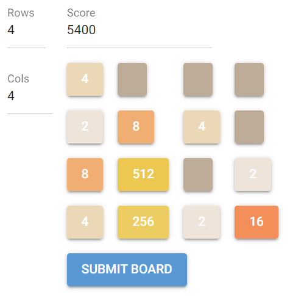
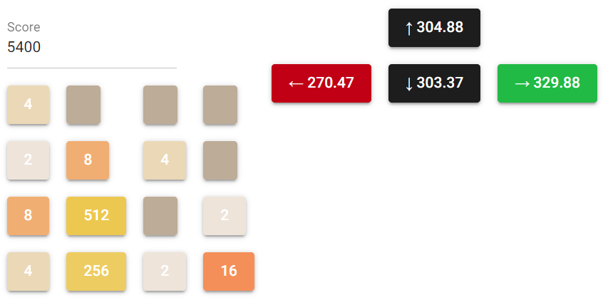
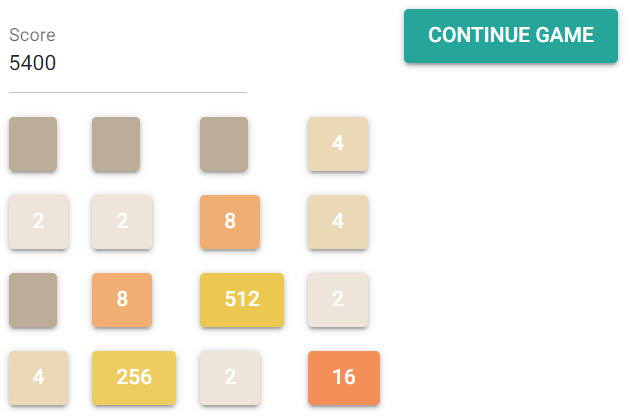

## Configurable Parameters

### 1. Board Dimensions
- **MAX_COLS** and **MAX_ROWS**
  - These define the maximum dimensions of the board.
  - By default, the board is 4x4, but you can change the dimensions through the GUI by setting new rows and columns.

### 2. Simulation Parameters
- **sims** (Default: 359)
  - The number of independent games to simulate with random moves.

- **depth** (Default: 100)
  - The maximum depth (number of moves) for each simulation.

You can override these defaults by providing parameters when calling the `simulate_game()` function from the `Tw48AiAssistant` class.

### 3. Stages of the Game

The game operates in three distinct stages, managed by the global variable **STAGE**, which helps track the current state of the gameplay logic. The stages are as follows:

1. **Setting Up the Board**
   - The user initializes the board's dimensions and inputs the current score and the current state of the tiles.
   - Example image:

     

2. **Performing Move**
   - The assistant simulates possible moves and provides a recommendation for the optimal move based on the highest average score.
   - Example image:

     

3. **Adding the New Tile**
   - The user inputs the new tile's value and position after executing the suggested move.
   - Example image:

     

The **STAGE** variable ensures that the game flow is orderly and prevents errors from invalid inputs or out-of-sequence operations. Each stage transitions smoothly to the next, maintaining a logical progression for the gameplay.

---
